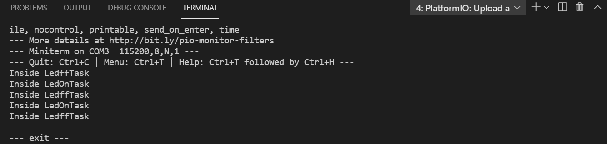

# PRACTICA 4
### PARTE B:
Tomando como ejemplo la primera parte por tal de crear 2 tareas distitas primero hemos de crear las dos funciones necesarias, una para apagar el led y otra para encenderlo, estas dos deveran usar la tasca del semaforo ya programada por defecto pasandole los parametros correctos y en cuanto a programacion dentro de estas dos funciones deveran ser completamente iguales salvo por la parte del digitalWrite el cual es la funcion que se usa para encender (digitalWrite(LED,HIGH)) o apagar (digitalWrite(LED,LOW)) el led.
Para se concretos y describir el correcto funcionamiento de este programa explicare el conjunto de instruciones que se ecnuentran dentro de una de estas funciones, puesto que lo unico que se ve modificado en el caso contrario lo e explicado anteriormente, la fucnion se compone de un while(1), es decir que este se ejcutara mientras lo de dentro sea verdadero, dentro de este nos encontramos con la declaracion de la tasca de semaforo con sus respectivos paramentros, que son el semaforo binario declarado antes de las funciones y el portMAX_DELAY, seguidamente despues de esta declaracion un serial print por tal que se nos muestre cual de las dos funciones se esta ejecutando para evitar confusiones seguido de un digitalWrite para encender o apagar la luz con un delay por tal de ver bien el funcionamiento de este, para finalizar la funcion se ejecuta el comando xSemaphoreGive por tal de obtener el verdadero o falso y se mantenga el while con un delay em la tarea. 
Posteriormente hemos de porgramar el setup del programa por tal de que este cumpla con el objetivo propuesto de hacer un programa que a traves de dos tareas apage y encienda el led de forma sincronizada. Por ello primero declararemos el serial.begin a la misma velocidad que el monitor_speed del .ini, seguidamente declararemos el modo del pin de la led, en este caso OUTPUT declararemos tamb el semaforo binario a traves del comando xsemaphorecreatebinary(), seguidamente las dos funciones con sus parametros necesitados, estos los podemos copiar de la primera parte de esta practica y modificarle el nombre de la funcion para su correcta ejecucion i por ultimo haremos que se ejecute el comando xSemaphoreGive por tal de obtener el verdadero o falso y saber si se a ejecutado de forma correcta o no el programa.
Por ultimo del programa hemos de hacer el apartado del loop por tal que dentro de esta ejecuion de las dos tareas de manera infinita se ejecute con un delay de 1000 segundos y podamos observar su comportamiento y decidir si hace de forma sincronizada o no el programa de tascas sincronizadas. 
Como conlusion podemos decir que en mi caso este se hace de forma correcta ya que si observamos el monitor y lo comparamos con el montaje de la led este funciona correctamente.

